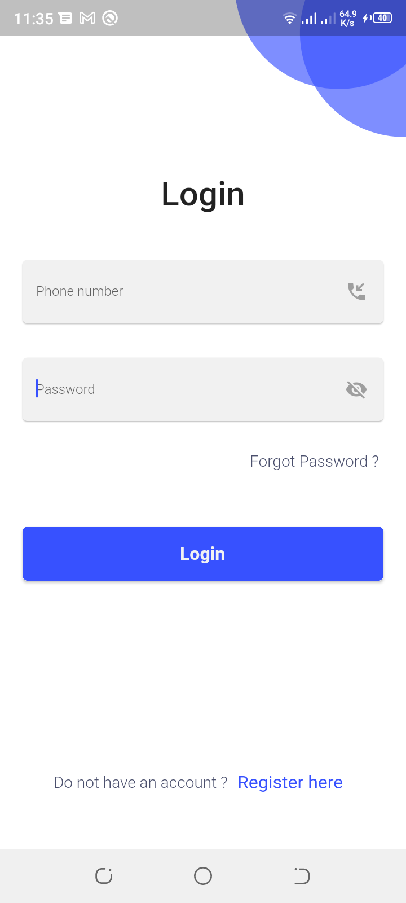
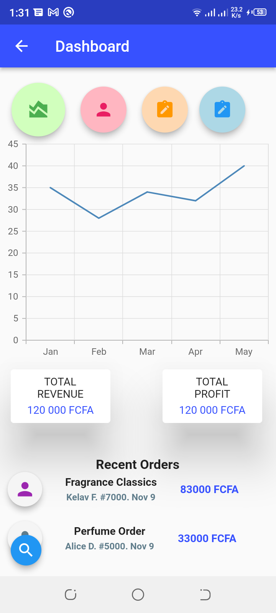

# flutter-warm-up

This code, has 2 screens. The login screen and the dashboard.
## Login

The login which takes the Phone number and Paswword.
A user cannot get to the dashboard without filling the login field.
## Dashboard

A static dashboard
